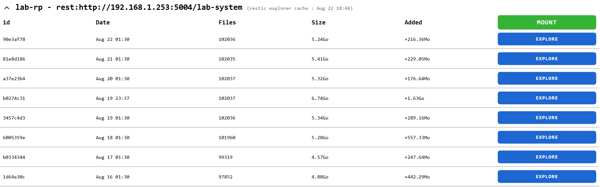
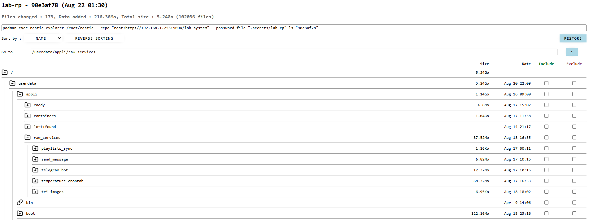

# What does this app do ?

It's a small explorer to have a full view of a restic snapshot.

# History :

I built this app for borg backups a few years ago but never published it. Moving on restic I reworked the code to adapt
it for restic.

This code is probably not the cleanest to see but I mostly did it years ago and it's not simple (a LOT of recursive
methods)

How many lines were vibe coded ? It was written in 2021. I tried to use a LLM to help me for few small methods but it
was rarely very a good idea. So there is probably something like 20 AI generated lines of code.

AS you'll notice I'm not really a designer (but I like the explorer page)

# Safety

## Passwords

On the start of the container, the passwords are written from the `params.ini` file to `/app/.secrets/`

## I don't want your app to mess with my backups or my files

And I don't want to mess with your stuff. This app only does consultation. Buttons like `mount` or `restore` just
summons a prompt with
a command line you'll have to copy and rework as you want.



## Caching

Restic extraction commands are really heavy si I "built" a cache system to avoid unnecessary load.

## Heavy requests

In my small save (new installation), the 102 000 files generates a 25MB request. Avoid using this app on a limited or
unstable network

# UI pages

## Snapshots listing

The page where you see all the snapshots present on your repo


## Snapshot explorer

The page where you can navigate in your snapshot



# API

```
GET /api/snapshots[?force_refresh=false]
GET /api/repo/{repo}/files/{snapshot_id}[?force_refresh=false]
```

`force_refresh` option tells the api to ignore cached data 